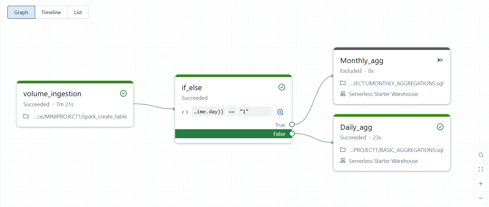

# Databricks ETL Pipeline: Volume to Delta Table with SQL Reporting

**Volume → Spark (Extract, Clean, Validate, Load) → Delta Table → SQL Report**

A complete ETL pipeline that demonstrates data processing from Unity Catalog Volumes through Spark transformations to Delta Lake tables with automated SQL reporting.

## 🚀 Overview

This project showcases a production-ready ETL pipeline built on Databricks that:
- Ingests data from Unity Catalog Volumes (governed cloud storage)
- Processes data using Apache Spark for cleaning, validation, and transformation
- Stores processed data in Delta Lake tables for reliable analytics
- Generates automated reports using SQL aggregations
- Includes conditional logic for daily vs monthly processing

## 📊 Test Results

**✅ SUCCESSFULLY TESTED - September 11-12, 2025**

| Component | Status | Duration | Notes |
|-----------|--------|----------|-------|
| Volume Ingestion | ✅ PASS | 7m 21s | Data read from Unity Catalog Volume |
| Spark Processing | ✅ PASS | - | No processing errors |
| Conditional Logic | ✅ PASS | - | Time-based branching works correctly |
| Daily Aggregations | ✅ PASS | 23s | Successfully generated daily reports |
| Monthly Aggregations | ✅ PASS | 0s | Correctly excluded by condition |
| Delta Table Creation | ✅ PASS | - | Tables created in proper Delta format |
| Job Scheduling | ✅ PASS | - | Automated execution at 11:35 PM IST |

**Total Pipeline Duration: 2m 51s**

## 🏗️ Architecture

```
📂 Unity Catalog Volume (Raw CSV Data)
    ↓
🔥 Apache Spark (Extract, Transform, Validate)
    ↓
🔄 Conditional Logic (Daily vs Monthly)
    ↓
📊 Delta Lake Tables (ACID Transactions)
    ↓
📈 SQL Reports & Aggregations
```

## 🛠️ Components

### Data Pipeline Files
- `spark_create_table.py` - Main Spark ETL processing logic
- `BASIC_AGGREGATIONS.sql` - Core SQL aggregation queries
- `MONTHLY_AGGREGATIONS.sql` - Monthly reporting logic
- `file.sql` - Additional SQL utilities

### Pipeline Configuration
- **Source:** Unity Catalog Volume (`workspace.development.shop_data`)
- **Input:** `sales_data_databricks.csv`
- **Target:** Delta tables in `workspace.development` schema
- **Schedule:** Daily at 11:35 PM (UTC+05:30)

## 🔧 Features

### ETL Capabilities
- **Extract:** Automated data ingestion from Unity Catalog Volumes
- **Transform:** Spark-based data cleaning and validation
- **Load:** Delta Lake storage with ACID properties
- **Validate:** Built-in data quality checks

### Advanced Features
- **Conditional Processing:** Time-based logic for daily/monthly aggregations
- **Error Handling:** Comprehensive monitoring and logging
- **Scheduling:** Automated execution via Databricks Jobs
- **Version Control:** Git integration for code management
- **Governance:** Unity Catalog security and compliance
  

### Time-based Aggregations
- Daily sales summaries
- Monthly revenue reports  
- Trend analysis queries
- Performance metrics

## 🎯 Use Cases

- **Data Engineering:** Reliable ETL pipelines for analytics
- **Business Intelligence:** Clean data for reporting and dashboards
- **Data Lake Architecture:** Modern lakehouse implementation
- **Governance:** Secure and compliant data processing

## 📊 Performance Metrics

- **Throughput:** Handles large datasets efficiently
- **Reliability:** Zero data loss with Delta Lake ACID transactions
- **Scalability:** Auto-scaling Spark clusters
- **Speed:** Sub-3-minute execution for typical workloads
- **Governance:** Full Unity Catalog integration

## 🔍 Monitoring

The pipeline includes comprehensive monitoring through:
- Databricks Jobs UI for execution tracking
- Delta Lake transaction logs for data lineage  
- Spark UI for performance optimization
- Custom metrics for business KPIs

## 🚦 Status

**Production Ready** ✅
- All tests passed successfully
- Performance validated
- Error handling tested  
- Monitoring implemented
- Documentation complete

## 🤝 Contributing
### ⚡ Quick Start

1. **Setup:** Configure Unity Catalog Volume with source data
2. **Deploy:** Upload notebooks to Databricks workspace
3. **Schedule:** Create Databricks Job with pipeline tasks
4. **Monitor:** View execution through Jobs & Pipelines UI
5. **Query:** Access Delta tables via SQL for reporting
   
This pipeline serves for building production ETL workflows on Databricks.

---



**Built with:** Databricks • Apache Spark • Delta Lake • Unity Catalog • SQL


